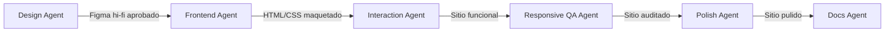

# AGENTS

Todos los "agentes" mencionados en este proyecto son roles que desempeña Claude (Cowork) en
pasadas separadas y claramente delimitadas — no son productos de IA distintos ni sesiones
independientes entre sí. Cada rol tiene una responsabilidad, entradas y salidas específicas, y
actúa solo cuando la fase correspondiente lo requiere. Solo se documentan aquí los agentes que
realmente han trabajado en el proyecto (ver cada `agents/<nombre>.md` para el detalle).

| Agente | Responsabilidad | Fase | Entradas | Salidas | Archivo |
|---|---|---|---|---|---|
| Design Agent | Fundamentos y páginas hi-fi en Figma | 1–2 | `design.md`, Notion, PEC 2 lo-fi | Variables, componentes y páginas en Figma | `agents/design-agent.md` |
| Frontend Agent | Maquetación HTML/CSS | 3 | Figma hi-fi, variables de Figma | `variables.css`, `base.css`, `layout.css`, `components.css`, HTML | `agents/frontend-agent.md` |
| Interaction Agent | JavaScript (tabs, hamburguesa) | 3 | HTML/CSS ya maquetados | `js/main.js` | `agents/interaction-agent.md` |
| Responsive QA Agent | Auditoría responsive de detalle | 4 | Sitio ya codificado | Tabla pass/fail, correcciones | `agents/responsive-qa-agent.md` |
| Docs Agent | README y cierre de documentación | 5 | `PLAN.md`, capturas, resultados de QA | `README.md`, `AGENTS.md` y skills finales | `agents/docs-agent.md` |
| Polish Agent | Auditoría de diseño de detalle (skill `apple-design`) y correcciones aprobadas | 6 | Sitio ya auditado en Fase 4, `design.md`, decisiones bloqueadas | Hallazgos con ID y severidad, correcciones por grupos, entradas 6.1–6.16 de `PLAN.md` | `agents/polish-agent.md` |

Nota: el Polish Agent actuó en la Fase 6 (ver `PLAN.md`, entradas 6.1 a 6.16). El diagrama muestra
el traspaso del trabajo, no el número de fase: el Polish Agent parte del sitio ya auditado en la
Fase 4 y el Docs Agent documenta el resultado.

## Diagrama de traspaso

