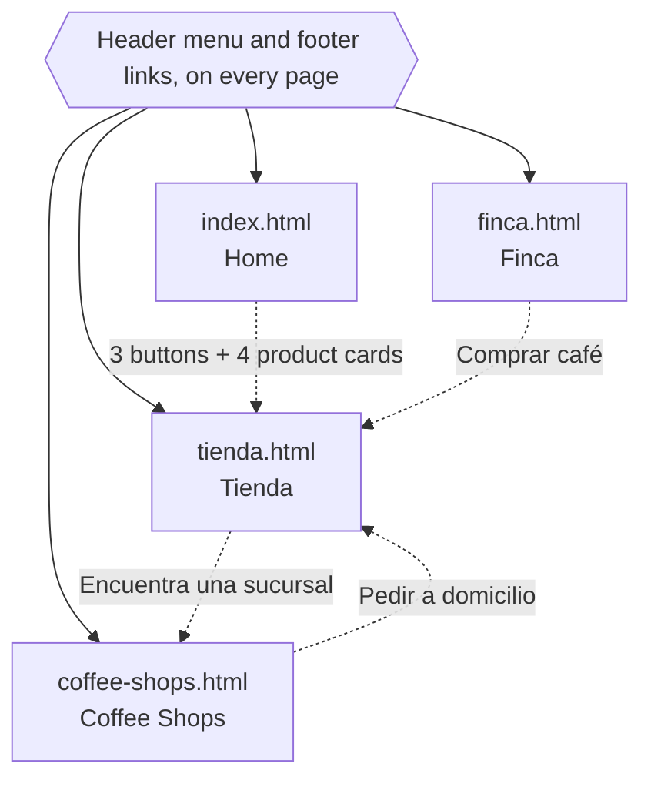

# El Injerto — AI-Assisted Redesign (PEC 6)

PEC 6 "Proyecto con IA" · CEI · Diseño Web · 2025/2026 · Nicolle Dardon

A second, complete version of a website, built with AI (Claude, in its Cowork mode) and compared
critically with the manual project (Book Nook). It restyles the website of **El Injerto**, a
Guatemalan specialty coffee brand ([elinjertocafe.com.gt](https://elinjertocafe.com.gt/)).
The site itself is in Spanish; this README is in English.

- **Repository:** https://github.com/nicolledardon/injerto-website-ai
- **Figma:** see [Figma Link](#figma-link)
- **Published site:** not published (see [GitHub Pages Link](#github-pages-link))

## Project Description

El Injerto is a four-page, fully navigable website: **Home**, **Tienda** (shop), **Finca** (the
farm) and **Coffee Shops**. The pages and their section order come from the PEC 2 wireframes;
the visual style was designed first in Figma (foundations, components and eight hi-fi frames: four
pages at 1440 px and at 375 px) and then coded.

| Page | File | What it contains |
|---|---|---|
| Home | `index.html` | Hero, "Encuentra tu sabor" (flavour steps), "Cafés de temporada" (4 product cards), "Arma tu suscripción" (subscription teaser) |
| Tienda | `tienda.html` | Category tabs Café / Accesorios, 4 coffee cards and 4 accessory cards, closing call to action |
| Finca | `finca.html` | "Nuestra historia", "De la semilla a la taza" (4-step Proceso timeline: Cultivo, Cosecha, Beneficio, Tueste), call to action |
| Coffee Shops | `coffee-shops.html` | The 4 branches (Z13, Plaza Cemaco, Periroosevelt, Zona Express 1) and a map that changes with the chosen branch, call to action |

Every page shares the same header (with a hamburger menu on mobile) and footer. The footer carries
the line "Proyecto académico de rediseño — no afiliado a El Injerto."

**Stack:** HTML, CSS and plain JavaScript. CSS uses native custom properties split over four files
(`variables.css`, `base.css`, `layout.css`, `components.css`, loaded in that order), mobile-first
`min-width` media queries at 480, 768, 1024 and 1280 px, and no `!important` anywhere. There is no
Sass, no framework, no build step and no npm dependency. The only external resource is the Google
Fonts stylesheet.

**Size at the time of writing:** 618 lines of HTML, 1,855 lines of CSS and 244 lines of JavaScript
(2,717 in total), in 46 commits made between 28 September and 1 October 2026.

**Content.** Copy, product names and prices were taken from the brand's public website
(prices as read on 1 October 2026). Product photos were supplied by Nicolle. The Home "Encuentra tu
sabor" and "Arma tu suscripción" blocks are deliberately **static teasers**: visually finished,
not functional. That is a scoping decision, not an omission.

## Scope: Restyle, Not Rebrand

This is a visual restyle. The brand name and logo are kept as they are; only colour, typography
and visual identity change, and only inside the section structure already defined in PEC 2.

Locked design decisions:

- **Direction:** premium and modern, built on saturated colour blocks. "Premium" comes from refined
  typography and thin gold accents, not from muting the colours.
- **Palette:** seven working colours plus tints, all defined once in `css/variables.css`.

  | Token | Hex | Role |
  |---|---|---|
  | `--color-ink` | `#1e1611` | Main text, dark backgrounds (footer, nav) |
  | `--color-surface` | `#faf5ec` | Default light background |
  | `--color-block-cherry` | `#e8422c` | Decorative colour block (never carries text) |
  | `--color-block-terracotta` | `#ef8a24` | Primary button background, selected chip |
  | `--color-block-pine` | `#16794c` | Decorative colour block (never carries text) |
  | `--color-accent-gold` | `#c9a227` | Decorative hairlines only, never a text colour |
  | `--color-text-secondary` | `#6b5d4f` | Secondary text |

- **Typography:** Fraunces (headings) and Work Sans (body), both from Google Fonts.
- **Reusable components:** a product card (coffee and accessory variants), a Proceso step, a
  button system (primary, secondary, tertiary) and category tabs.
- **Where the direction came from (PEC 1, Track B):** the original El Injerto site as the point to
  move away from, Hola Coffee for saturated colour blocking, Monogram for the generous product
  grid, Onyx for coffee data presentation and Verve for low-friction purchase UI.

## Figma Link

The design lives in the same Figma file as the PEC 2 wireframes and the PEC 3 designs:

- **PEC 6 hi-fi page** ("PEC 6 — El Injerto Hi-Fi": foundations, components, and the four pages at
  1440 px and 375 px):
  https://www.figma.com/design/C8CzTyhKqB1bXOBC3PZxYd/book-nook-website?node-id=308-2
- **PEC 2 low-fi wireframes for El Injerto:**
  https://www.figma.com/design/C8CzTyhKqB1bXOBC3PZxYd/book-nook-website?node-id=7-4

## GitHub Pages Link

The site is **not published** on GitHub Pages. The repository is
https://github.com/nicolledardon/injerto-website-ai.

To run it locally, open `index.html` in a browser, or serve the folder with the VS Code Live Server
extension. Pages link to each other with relative paths, so no server setup is needed.

## File Structure

```text
injerto_website_ai/
├── index.html            Home
├── tienda.html           Shop (Café / Accesorios tabs)
├── finca.html            Farm story and Proceso timeline
├── coffee-shops.html     Branches and map
├── css/
│   ├── variables.css     Design tokens (colour, type, spacing, motion)
│   ├── base.css          Reset, type scale, focus style, .sr-only, reduced motion
│   ├── layout.css        Container, header, footer, section rhythm, grids
│   └── components.css    Buttons, product card, Proceso step, tabs, shop map
├── js/
│   └── main.js           Menu, tabs, Proceso animation, shop map (no dependencies)
├── assets/img/
│   ├── logo.svg
│   ├── productos/        8 transparent product cut-outs (coffee bags and accessories)
│   ├── mapas/            5 illustrated maps for Coffee Shops
│   └── product1-4.webp, accesorio1.webp, accesorio2.webp,
│       accesorios3.webp, accessorio4.webp   Original product photos
├── PLAN.md               Complete project history, one entry per step
├── AGENTS.md             The AI roles that worked on the project and how they hand off
├── agents/               One file per role (design, frontend, interaction, responsive-qa,
│                         docs, polish)
├── skills/               The project rules: design-tokens, css-architecture, accessibility,
│                         responsive-detail, git-workflow
├── README.md
├── .gitignore            Files Git never uploads (.DS_Store, zips, logs, node_modules)
└── .gitattributes        Consistent line endings; images and fonts marked as binary
```

## Navigation Diagram



Solid arrows are the shared navigation (every page links to all four). Dotted arrows are the
in-page calls to action. Every page ends in a way forward; Tienda's product cards are not links
because there are no product pages (see PLAN 6.11).

## AI Tools Used

All the AI work in this project was done with **Claude (Anthropic)**, used through the Claude
desktop app in Cowork mode. The commit trailers record **Claude Sonnet 5** (19 commits) and
**Claude Sonnet 5.5** (25 commits). No other AI tool is documented in `PLAN.md`.

What Claude worked with:

| Tool | Used for |
|---|---|
| Figma connector | Building the PEC 6 hi-fi page (variables, text styles, components, 8 frames), taking screenshots and reading variable definitions to write `variables.css` |
| Local file and shell access | Writing the HTML, CSS and JavaScript in this folder and running `git commit` (only after Nicolle approved each commit; Nicolle ran every `git push` herself) |
| Playwright with Chromium | Measuring the built pages (overflow, tap targets, contrast, animation timings) instead of judging by eye |
| `apple-design` skill | The Phase 6 design audit (see [Polish pass](#polish-pass-apple-design-skill)) |

**Roles.** Claude worked in clearly separated passes, each with its own rules, inputs and outputs.
They are roles played by the same AI, not different products. `AGENTS.md` has the full table and
hand-off diagram; each role has its own file in `agents/`.

| Role | Phase | Did |
|---|---|---|
| Design Agent | 1–2 | Figma foundations, components and hi-fi pages |
| Frontend Agent | 3 | `variables.css`, `base.css`, `layout.css`, `components.css`, the four HTML pages |
| Interaction Agent | 3 | `js/main.js` |
| Responsive QA Agent | 4 | Detailed responsive audit and fixes |
| Polish Agent | 6 | Design audit with the `apple-design` skill and approved fixes |
| Docs Agent | 5 | This README and the closing documentation |

The phases ran with a stop ("gate") after each one: nothing was coded until the hi-fi design was
approved, and from Phase 3 each commit waited for Nicolle's explicit "aprobado".

## Main Prompts

`PLAN.md` logs a faithful summary of each request, in Spanish and English as it was given. These
are the main ones, translated where needed. They are summaries kept in `PLAN.md`, not verbatim
transcripts.

**Kickoff prompt (28 Sep).** One long structured prompt set the whole working method: Claude's role
(product designer and front-end developer building El Injerto end to end), the locked design
decisions, the rules (everything in Spanish except this README, no `!important`, no commit without
approval, one step at a time, challenge my decisions), the phases with their gates and the grading
rubric. It is kept with the course project notes, outside this repository.

| Phase | Prompt | Result |
|---|---|---|
| 0 · Setup | "Start PEC 6 (El Injerto, project with AI): create the repository, follow the phase workflow (Figma hi-fi → approval → code), all project content in Spanish except the README, review each step with me before moving on." | Repository, `.gitignore`, `.gitattributes`, `PLAN.md`, `AGENTS.md`, README skeleton |
| 1 · Figma foundations | Approved the proposed colour, type, button, tab, header and footer system, after first asking to see a visual reference. | Variables, text styles and components in Figma |
| 2 · Figma pages | "move forward", plus the content source: "it's this site https://elinjertocafe.com.gt/" | Four pages at 1440 px and 375 px |
| 3 · Code | "lets start", then "go" / "go ahead" for each next page, then "move on to javascript" | Four CSS files, four HTML pages, `main.js` |
| 4 · Responsive | "starttt", then "lets fix all fails" | 5 failures and one extra bug fixed, one commit each |
| 4 · Proceso | "the 2x2 is shown but I would like it to be all in one vertical, and to add some sort of fun bouncy animation to it, and fix the two target fails before we move on to phase 6" | Vertical timeline, bounce animation, 2 tap-target fixes |
| 4 · Proceso | "before we commit or push, can we improve the animation on timeline proceso please", then "also fix the connectors to be more centered in the desktop version" | Connector that draws itself, aligned connectors |
| 6 · Audit | "Using the apple-design skill, audit PEC 6 El injerto page against Apple's design principles. Go through spacing, hierarchy, typography and motion separately, and tell me what is wrong and why it matters." (Home first, then the other three pages in one pass) | Findings with IDs and severities (20 for Tienda, Finca and Coffee Shops; the Home in five groups), applied group by group |
| 6 · Audit | "apply all groups in proposed order and s2, a1 and h3 is approved" | Five Home groups, five commits |
| 6 · Photos | "On PEC 6 I want to add the product and accessory images I put in the assets folder, centred in the colour block and the size of the dark shadowed shape in the Figma wireframes, and when the cursor goes over the product the image (not the whole container) should get bigger. First propose how you would do it and, with my approval, add the code." | Cut-outs, photo in each card, hover zoom |
| 6 · Photos | "I'd rather commit the original photos too. Make the bags bigger. When that's done, it's approved." and "Use the prices from the website." | Larger bags, corrected prices |
| 6 · Map | "In Coffee Shops I want the grey container to be a real map of each branch, changing with the one I press; if none is pressed, a zoomed-out map with all locations. It doesn't have to be interactive: images of a map with the location point are fine. You generate the map image." | Five map images and the switching script |

## AI-Generated vs. Manually Edited

**What the AI generated.** Claude generated all of the code, design and documentation in this
repository: the Figma design, the four CSS files, the four HTML pages, `js/main.js`, the eight
product cut-outs (made from Nicolle's photos), the five illustrated maps, and `PLAN.md`,
`AGENTS.md`, the `agents/` and `skills/` files and this README. `PLAN.md` records no hand-typed
code: Nicolle did not write or edit the code files herself.

**What Nicolle did.** Her work was to direct, decide and approve:

- She supplied the inputs: the real logo, the product photos, and the website as the content source.
- She approved the Figma design at each gate before any code was written.
- She approved the commits, and from Phase 3 each one waited for her explicit "aprobado". One
  commit (`fb1e1ed`, the first CSS files) went ahead without its own approval; Claude spotted it
  itself, logged it in `PLAN.md`, and Nicolle chose to keep it and tighten the rule from then on.
- She made the design decisions that shaped the result. A few examples: the Proceso timeline goes
  vertical on mobile (and later up to 1024 px), the animation repeats on scrolling back, the
  tab underline is ink instead of terracotta, Tienda gets one call to action instead of eight
  product links, tabs are hidden when JavaScript is off, the map is limited in size rather than
  recoloured, and the map images are illustrations.
- She rejected suggestions: playing the Proceso animation only once, and the multi-bounce easing.
- She decided how to handle bad source data: the Periroosevelt address on the brand's site looks
  like unedited template text, so it was replaced with the real street the name refers to
  ("Calzada Roosevelt, Zona 11"; `PLAN.md` 6.20 notes that other sources disagree on that
  branch's address).

**What had to be corrected.** The AI's first versions were wrong in several places. These came out
of its own checks or of the audits, and were fixed before or after review:

| Where | Problem | Fix |
|---|---|---|
| Figma, Home | The selected size chip had light text on terracotta (2.32:1 contrast). The first diagnosis blamed the button system, but inspecting the real nodes showed the buttons were already correct | Fixed the chip only |
| `tienda.html` | The Accesorios panel had a static `hidden` attribute, so its products were unreachable without JavaScript | Removed it; the script now hides the inactive panel |
| `base.css` | The list reset removed bullets but not the 40 px default padding, so every list in the site was indented by mistake | Added `padding: 0` |
| `components.css` | The four hover rules were not inside `@media (hover: hover)` | Wrapped them |
| Several components | Long words overflowed at 320 px | `min-width: 0` and `overflow-wrap: anywhere` |
| Footer links, mobile menu, tabs, nav "Home", logo | Tap targets under 44 px; the second audit pass found two the first one had missed | Padding and negative margins that keep the visual layout |
| `main.js` | The mobile menu stayed open after clicking one of its links | Close on link click |
| Product cards | Three of the supplied photos matched no card (Geisha G1, Cold Brew, Filtros Hario V60), so the cards were renamed after the photos and briefly kept the old prices | Prices corrected from the brand's website (PLAN 6.19) |
| Coffee Shops | The generated maps look like real maps, but their streets are drawn by a script | They are documented as illustrations; pin positions use real coordinates for three branches and an estimate for Z13 |

## JavaScript Interactions

`js/main.js` has four interactions (the brief asks for at least one), with no dependencies. Each
function checks that its markup exists, so the same script loads on every page. All of them
degrade gracefully without JavaScript.

| Interaction | Where | How it works |
|---|---|---|
| Mobile menu | Every page, under 768 px | Hamburger button with `aria-expanded` and `aria-controls`; Esc closes it and returns focus to the button; clicking a link closes it; the icon turns into an X. Without JavaScript the footer navigation (always visible) replaces it. |
| Category tabs | `tienda.html` | The complete ARIA tabs pattern: `aria-selected`, roving `tabindex`, ← / → with wraparound, Home and End. Without JavaScript the tabs are hidden and both product lists are shown one after the other. |
| Proceso entrance animation | `finca.html` | An `IntersectionObserver` adds `.is-visible` when a step enters the screen; the movement itself is CSS (a connector that draws itself, a bounce, one pulse). It replays when you scroll back up. Without JavaScript or under `prefers-reduced-motion`, everything is simply visible. |
| Shop map | `coffee-shops.html` | Each branch name becomes a button (`aria-pressed`) that fades in that branch's map; pressing it again returns to the general map. On narrow screens the page scrolls to the map if it is not fully in view. Without JavaScript the general map is shown. |

The product-card hover zoom is pure CSS, inside `@media (hover: hover)`.

## Accessibility Decisions

- **Language and structure:** `<html lang="es">`, one `<h1>` per page, landmarks (header, labelled
  navs, main, footer), a "Saltar al contenido principal" skip link that appears on focus, and
  `aria-current="page"` on the current page in the menu.
- **Keyboard and focus:** the menu, tabs and branch buttons were tested with the keyboard; the
  focus ring is ink-coloured, which departs from Figma's terracotta because it contrasts better.
- **Contrast:** every text and background pair was computed with the WCAG 2.1 formula before coding
  (body text on the light background is 16.41:1; ink on the terracotta button is 7.07:1, and 4.64:1
  in its pressed state). Cherry, pine and gold are decorative colours and are not used behind text.
  The selected tab and the current page use an ink underline (16.41:1) instead of terracotta
  (2.32:1), and the state is never shown by colour alone: it is also bold and 3 px thick.
- **Menu pattern:** a disclosure button (`aria-expanded`, `aria-controls`), not a menu role.
- **Tabs pattern:** full ARIA tabs with arrow-key navigation (see above).
- **Shop map:** branch buttons use `aria-pressed`; the inactive map images are `aria-hidden`;
  the map images have Spanish alt text that says they are illustrative.
- **Lists:** the Proceso timeline is a real list of four items; the decorative connectors are
  `aria-hidden`.
- **Touch targets:** at least 44 × 44 px for links, tabs, buttons and footer links, with at least
  8 px between neighbours.
- **Text size:** the layout was tested with the root font size at 150% and 200%. The header no
  longer collides with the menu button at large text sizes.
- **Motion:** every duration is a token that `base.css` sets to nearly zero under
  `prefers-reduced-motion`. Hover effects only apply on devices that can hover, and nothing is
  reachable only by hover.
- **Forms:** the only form control is the disabled frequency field in the subscription teaser; it
  has a visually hidden label.
- **Images:** every `` has an `alt`: Spanish descriptions for products and maps, and an empty
  `alt` for the logo icon next to the text "EL INJERTO", which already names the link.

Not tested: a real screen reader (VoiceOver or NVDA), real touch input, Safari and Firefox.

## Responsive Audit Results

Phase 4 was a detailed responsive audit, run as an 18-rule checklist
(`skills/responsive-detail/SKILL.md`) and **measured in Chromium with Playwright**, not judged by
eye. Every page was checked at 320, 375, 414, 768, 1024, 1280 and 1440 px, plus 375 × 667 in
landscape and an approximation of 200% zoom (a viewport half as wide). The layout is mobile-first,
with `min-width` breakpoints at 480, 768, 1024 and 1280 px.

**First run:** 13 of 18 rules passed, 2 did not apply to this design (no full-screen hero and no sticky
header), and 5 failed. Each failure was fixed in its own commit:

| Rule | What was wrong | Fix |
|---|---|---|
| Hover only on devices that hover | The four `:hover` rules were not inside `@media (hover: hover)` | Wrapped them |
| Long words do not overflow | A 108-character word broke six components at 320 px | `min-width: 0` and `overflow-wrap: anywhere` |
| Tap targets of at least 44 px | Footer links were 43 × 17 px, menu links 49 × 21 px, the "Café" tab 41 px wide | Padding, with negative margins so nothing moves visually |
| Mobile menu closes on link click | Esc worked, clicking a link did not | A click handler in `main.js` |
| Line length of about 70 characters | Paragraphs reached 83 characters at 768 px | `max-width: 65ch` |

The audit also exposed a bug that no rule covers: the list reset left the browser's 40 px default
padding on every `<ul>`, so all lists were indented by mistake (fixed with `padding: 0`).

**Second run (after the fixes):** it found two tap-target failures the first run had missed (the "Home"
link in the header nav at 43 px, and the logo links at 35 px). Both were fixed. The result:
**0 of 36 page and width combinations** (4 pages × 9 conditions) showed horizontal scroll, overflow, or
a tap target below 44 px.

**Later changes:**

- Phase 6 re-ran the layout across 9 widths × 3 text sizes × 4 pages, and compared screenshots pixel
  by pixel to make sure each fix changed only what it was meant to change.
- The product photos and hover zoom were checked at 375, 768 and 1440 px (no layout shift, no
  overflow, reduced motion, hover only on hover devices).
- The shop map was checked at 375, 768, 1024 and 1440 px: 112 checks, 0 failures.
- Mobile body text was kept at Figma's 15 px until the Phase 6 typography pass raised it to 16 px.
- The Proceso timeline is a single column up to 1024 px (Figma showed a 2 × 2 grid on mobile and a
  row from 768 px; at 768 to 1023 px the steps were 122 px wide with captions of five lines).

**Not covered:** only Chromium was used, and fonts were served from a local copy during testing.
Real devices, Safari, Firefox and real touch input were not tested. Rules 4 (no fixed heights), 15
(text contrast over busy crops) and lazy-loading were not re-measured after the last round of fixes.

## Polish pass (apple-design skill)

After the responsive QA, Phase 6 was a polish pass over all four pages. Claude (Cowork) ran it
with the `apple-design` skill, a design reviewer built on Apple's Human Interface Guidelines. The
guidelines are written for native apps, so on the web only their principles and foundations
(accessibility, layout, typography, colour, motion) were applied, not the platform conventions.
Claude did the audit and wrote the code changes; Nicolle chose which groups of findings to apply
and approved every commit.

**How it worked**

1. A read-only audit of each page, measured in Chromium from 320 to 1920 px and at 100, 150 and
   200% text size (box sizes, contrast computed from the hex values, tap targets, animation
   timings), on four axes: spacing, hierarchy, typography and motion, plus accessibility.
2. Every finding got an ID and a severity, and was flagged when it touched a locked design
   decision.
3. Nicolle picked the groups to apply. Each fix was tested in a scratch copy first (a matrix of
   9 widths x 3 text sizes x 4 pages, and a pixel comparison of screenshots to check that only
   the intended pages changed) and then applied.
4. One commit per group, made only after Nicolle approved it. Each commit has its own entry in
   `PLAN.md` (Phase 6.1 to 6.16, with the hash of every commit in 6.16).

**Results**

- Home: five groups, five commits (PLAN 6.1 to 6.5).
- Tienda, Finca and Coffee Shops: 20 findings (1 Critical, 4 High, 6 Medium, 9 Low), all applied
  or decided in ten commits (PLAN 6.6 to 6.15). Some were applied only in part, and the PLAN
  entries say which.
- What a visitor notices: the header no longer collides with the menu button at large text sizes;
  the selected tab and the current page use an ink underline (contrast 2.32:1 became 16.41:1);
  product cards no longer jump to 700 px wide between breakpoints; the Finca process stays
  vertical until 1024 px and is a real list with headings; shop phone numbers on Coffee Shops are
  tap-to-call links and the map no longer outweighs the list; Tienda, Finca and Coffee Shops each
  end with a call to action.

**Deliberate departures from Figma** (each one approved by Nicolle and recorded in `PLAN.md`)

- The "Merch" tab is called "Accesorios".
- The selected-tab and current-page underline is ink instead of terracotta.
- The process timeline is vertical up to 1024 px (Figma had a row from 768 px).
- Process step names are real `h3` headings in the display font (Figma used a 14 px label).
- The Coffee Shops map is 16:9 at 768 px and 4:3 from 1280 px (Figma had 1:1).
- Finca, Coffee Shops and Tienda each gained a call-to-action link.

**Known limits**

- Text-only enlargement was emulated by setting the root font size to 200% in Chromium. Real iOS
  Dynamic Type, Safari and Firefox text-only zoom were not tested, and neither were a screen
  reader or real touch input. Fonts were served from a local copy during testing.
- At 320 px with 200% text, long words still break mid-word ("conqui/stó"). On phones at 250% text
  or more the wordmark is wider than the screen, and the Finca process captions break words at
  150 to 200% text from 1024 px.
- With enlarged text some widths show three product cards in a row and one below.

See `agents/polish-agent.md` for the role and its rules.

## Comparison with the Manual Project (Book Nook)

<!-- Draft written from the evidence in PLAN.md and both repositories. The opinions below are
     Nicolle's to confirm or change before submitting. -->

Book Nook is the manual track: a six-page site for a reading-tracking app, built per its README
as a hand-coded build. Its git history also shows Claude as co-author on 14 of its 25 commits
(ten PEC 4 responsive, rem, BEM and SEO corrections, and four later PEC 5 commits), so this is a
comparison between a project built mostly by hand and one built entirely with AI, not between AI
and no AI at all.

| | Book Nook (manual) | El Injerto (AI) |
|---|---|---|
| Pages | 6 | 4 |
| Commits | 25 (21–28 Sep) | 46 (28 Sep – 1 Oct) |
| Commits with a Claude co-author trailer | 14 | 44 |
| HTML + CSS + JS lines | 3,035 | 2,717 |
| JavaScript | 486 lines, 6 interactions | 244 lines, 4 interactions |
| CSS files | `variables`, `base`, `layout`, `components` | the same four |
| `!important` in the CSS | 0 | 0 |
| Departures from the Figma design | 8 (listed in its README) | 11 (listed in `PLAN.md`) |
| Written record of the process | README, Git history | README, `PLAN.md` (about 1,600 lines), `AGENTS.md`, `agents/`, `skills/`, Git history |

The two projects are not the same size, were built over different spans, and each has other
coursework running alongside it, so the numbers show scale, not speed or quality.

### What was faster with AI?

The first complete version. On 28 September the first commit is at 17:16 and the commit that adds
`js/main.js` is at 21:15: about four hours (including the time spent reviewing and approving) for
the Figma foundations and components, eight hi-fi frames, four CSS files, four HTML pages and the
script. Everything else that was fast was repetitive and measurable: the contrast ratios of 13
colour pairs, the sweep of 36 page and width combinations, a 20-finding design audit, and a project
log written as the work happened. The AI was not faster at deciding what to build; that stayed
slow because it was the part I had to judge.

### What was harder to control?

The things the AI assumed without saying so, and the things it believed it had checked. It first
blamed the Figma button system for a contrast failure that was really one chip; it swapped a planned
product it could not price (Maragogype) for another one (Cold Brew), and it renamed three product
cards after their photos while keeping the old prices. Its own first responsive sweep missed two
tap-target failures. The Figma tooling also fought back: new auto-layout frames came with a white
fill that hid the dark background, a resize silently reset sizing modes, and a long base64 string
was corrupted twice before it was split into checksummed pieces. Finally, motion was verified by
sampling states in a browser, not by watching it, and the map images look like maps but are
illustrations. Each `PLAN.md` entry lists what was not verified for exactly this reason.

### Which parts of the code did I have to correct?

20 of the 46 commits are `fix` commits. The main ones: the list indentation bug on every `<ul>`, the
five responsive rule failures plus two more tap-target failures, the hidden Accesorios panel that
made products unreachable without JavaScript, the stale prices and names on three product cards
(and, in Figma before coding, the light-on-orange chip), and the 20 design findings of the Phase 6
audit (one Critical: the header colliding with the menu button at large text sizes). The full table
is in [AI-Generated vs. Manually Edited](#ai-generated-vs-manually-edited). Some of these were the
AI correcting its own earlier output, which is a reason to keep a log.

### Which visual result is more faithful to the PEC 3 design?

I have not compared screenshots of either project against Figma, so this is not a measured result.
What the record shows: El Injerto's colour and type tokens were taken straight from the Figma
variable definitions, whereas Book Nook's CSS needed a correction pass after PEC 4 (px to rem,
undefined radius tokens, spacing "per Figma values from Nicolle", a confirmation panel that was
visible on load). On the other hand, El Injerto drifted away from Figma on purpose after the first
build, in 11 documented places, mostly because measuring found accessibility problems: ink focus
ring instead of terracotta, 16 px mobile body text instead of 15 px, 40 px header padding,
terracotta reserved for actions, the Accesorios tab name, an ink tab underline, a vertical Proceso
up to 1024 px, process step names as real headings, map proportions, three added calls to action and
larger coffee bags. Book Nook's 8 departures are mostly structural choices (one waitlist file
instead of two pages, a rebuilt CTA banner, unified book cards). My judgement is that El Injerto
started closer to the design and ended further from it, by choice; I cannot say the same of Book
Nook without a side-by-side check.

### What did I learn from comparing both processes?

That the AI is only as reviewable as the process around it. The gates (no code before the design was
approved, no commit before my "aprobado", a log written step by step) are what let me find the
mistakes above, and they are what the manual project lacks. I also learned that measuring beats
looking: the audit run in a browser found failures that a visual check had passed. The AI will apply
every suggestion unless I refuse, so my real contribution was the decisions: which findings to
apply, which to reject, and where to leave the design. And the comparison itself is not clean:
because Claude also helped with part of Book Nook, the useful lesson is less "AI or no AI" than how
deliberately the AI is used and how well that use is written down.

## License / Academic Disclaimer

This is an academic project made for the CEI "Diseño Web" course (PEC 6, academic year 2025/2026).
It is **not affiliated with, endorsed by or connected to El Injerto**.

- The El Injerto name, logo, product names, product photos, copy and prices belong to their
  owners and are used here only for study and portfolio purposes. Prices are as read on
  1 October 2026 and are not kept up to date.
- The Coffee Shops maps are illustrations, not real maps; pin positions are approximate and
  must not be used for navigation.
- Fonts: Fraunces and Work Sans, served by Google Fonts under the SIL Open Font License.
- The `apple-design` skill used in Phase 6 is a third-party tool and is not part of this repository.
- AI use is described in full above and in `PLAN.md`: Claude generated the code, design and
  documentation of this project, and Nicolle directed and approved it.
- No licence file is included, so all rights to the original code are reserved by default; the
  repository is shared for academic evaluation.

